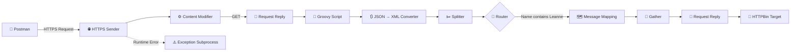
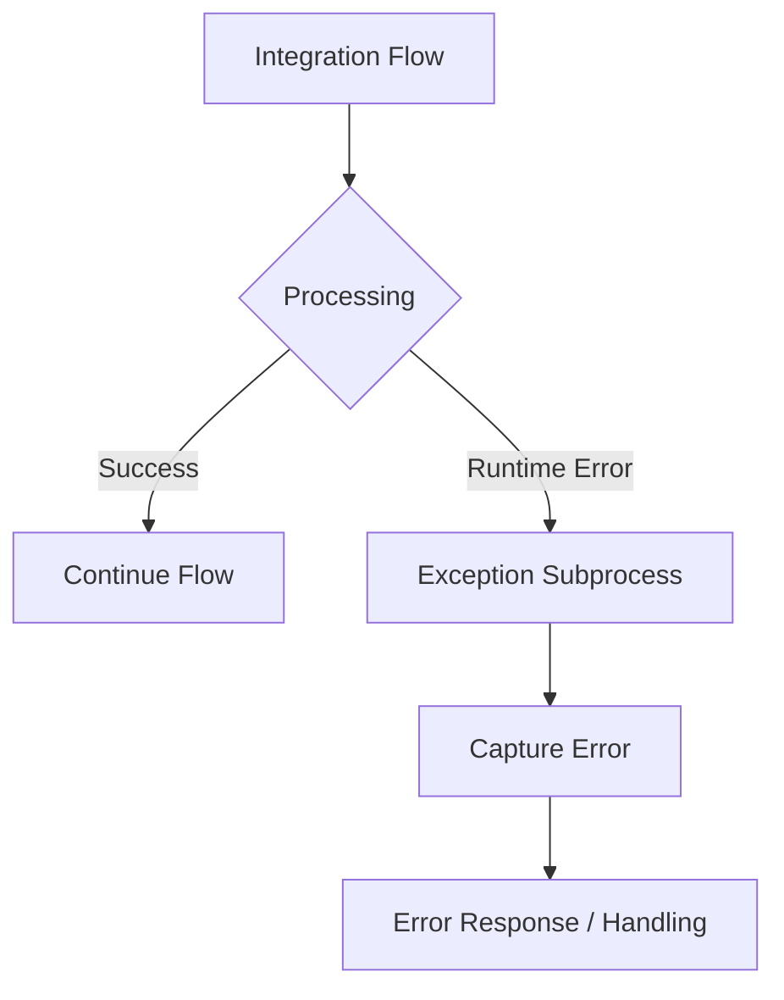

# 🚀 SAP CPI — Employee Data Integration

<p align="center">

**End-to-End Employee Data Integration using SAP Cloud Integration**

<br>


</p>

<p align="center">
  <b>API Integration • Transformation • Routing • Message Processing • Exception Handling</b>
</p>

---

## 📌 Project Overview

This project demonstrates an **end-to-end employee data integration scenario using SAP Cloud Integration (CPI)** within **SAP Integration Suite on SAP BTP**.

The integration flow retrieves employee information from an external REST API, processes and transforms the data, splits individual employee records, applies conditional routing, maps the required fields, gathers the processed messages, and sends the final payload to a target endpoint.

The project demonstrates several commonly used **SAP CPI integration patterns and message-processing capabilities** in a single integration flow.

---

## 🏗️ Integration Architecture



### 🔄 High-Level Flow

**Client → SAP CPI → External API → Processing → Transformation → Filtering → Mapping → Aggregation → Target System**

---

## 🧩 Integration Flow Components

| #  | CPI Component            | Purpose                                     |
| -- | ------------------------ | ------------------------------------------- |
| 01 | **HTTPS Sender**         | Receives the incoming integration request   |
| 02 | **Content Modifier**     | Sets message properties and headers         |
| 03 | **Request Reply**        | Retrieves employee data from the source API |
| 04 | **Groovy Script**        | Processes and prepares the incoming payload |
| 05 | **JSON → XML Converter** | Converts JSON data into XML                 |
| 06 | **Splitter**             | Separates individual employee records       |
| 07 | **Router**               | Applies conditional message routing         |
| 08 | **Message Mapping**      | Transforms source fields into target fields |
| 09 | **Gather**               | Combines the processed messages             |
| 10 | **Request Reply**        | Sends the resulting payload to the target   |
| 11 | **Exception Subprocess** | Handles runtime integration errors          |

---

# 🔄 Integration Flow

## 1️⃣ HTTPS Sender

The integration flow exposes an HTTPS endpoint that can be triggered using **Postman**.

```text
POST /EmployeeSync
```

The request starts the employee synchronization process inside SAP Cloud Integration.

---

## 2️⃣ Content Modifier

The **Content Modifier** is used to configure message information required during processing.

It can be used to define:

* Headers
* Properties
* Message content
* Runtime tracking information

---

## 3️⃣ Request Reply — Retrieve Employee Data

The first **Request Reply** step communicates with an external REST API.

### Source API

```text
https://jsonplaceholder.typicode.com/users
```

The API returns employee/user information in JSON format.

Example structure:

```json
{
  "id": 1,
  "name": "Leanne Graham",
  "username": "Bret",
  "email": "Sincere@april.biz"
}
```

---

## 4️⃣ Groovy Script — Payload Processing

A **Groovy Script** is used to process the incoming employee payload before further transformation.

The script prepares the data for subsequent CPI processing and transformation steps.

### Key concepts demonstrated

* Groovy scripting
* Message payload processing
* JSON handling
* Dynamic message processing

---

## 5️⃣ JSON → XML Conversion

The employee JSON payload is converted into XML.

```text
JSON
  ↓
JSON → XML Converter
  ↓
XML
```

XML is then used by subsequent CPI processing components such as the **Splitter** and **Message Mapping**.

---

## 6️⃣ General Splitter

The employee collection is divided into individual employee messages.

```text
Employee Collection
        │
        ├── Employee 1
        ├── Employee 2
        ├── Employee 3
        ├── Employee 4
        └── ...
```

This allows each employee record to be processed independently.

---

## 7️⃣ Router — Conditional Processing

The **Router** applies a business condition to the individual employee messages.

### Condition

```text
Employee name contains "Leanne"
```

Only matching employee records continue through the selected processing route.

```text
Employee Record
       │
       ▼
   ┌─────────┐
   │ Router  │
   └────┬────┘
        │
   Name contains
     "Leanne"
        │
        ▼
 Message Mapping
```

This demonstrates conditional routing within SAP Cloud Integration.

---

## 8️⃣ Message Mapping

The selected employee records are transformed into the target structure.

### Source → Target Mapping

| Source Field | Target Field |
| ------------ | ------------ |
| `id`         | `empId`      |
| `name`       | `fullName`   |
| `email`      | `emailId`    |

### Transformation

```text
Source                         Target

id        ──────────────────►  empId

name      ──────────────────►  fullName

email     ──────────────────►  emailId
```

---

## 9️⃣ Gather — Combine Messages

After individual employee messages are processed, the **Gather** step combines the resulting messages.

```text
Employee 1 ──┐
             │
Employee 2 ──┤
             ├──► Gather ──► Combined Payload
Employee 3 ──┤
             │
Employee N ──┘
```

This allows the processed records to continue as a consolidated message.

---

## 🔟 Request Reply — Target System

The final payload is sent to the target endpoint using **Request Reply**.

### Target

```text
https://httpbin.org/post
```

HTTPBin is used as a demonstration endpoint for receiving and inspecting the generated request.

---

# ⚠️ Exception Handling

The integration flow includes an **Exception Subprocess** for runtime error handling.



The Exception Subprocess provides a controlled path for handling failures instead of allowing unexpected runtime errors to terminate processing without handling.

### Error-handling concepts

* Runtime exception handling
* Error-path processing
* Controlled failure response
* Integration monitoring support

---

# 🧠 SAP CPI Concepts Demonstrated

This project brings multiple **Cloud Integration** capabilities together:

### 🔌 Integration

* Integration Flows
* HTTPS Sender
* REST API communication
* Request Reply
* External API integration

### 🔄 Message Processing

* Content Modifier
* JSON → XML Conversion
* Splitter
* Router
* Gather
* Message Mapping

### 💻 Development

* Groovy Scripting
* JSON processing
* XML processing
* Payload transformation

### ⚠️ Reliability

* Exception Subprocess
* Runtime error handling

---

# 🛠️ Technology Stack

| Technology                      | Usage                                 |
| ------------------------------- | ------------------------------------- |
| **SAP BTP**                     | Cloud platform                        |
| **SAP Integration Suite**       | Integration platform                  |
| **SAP Cloud Integration (CPI)** | Integration flow development          |
| **Groovy**                      | Custom message processing             |
| **REST API**                    | Source and target communication       |
| **JSON**                        | Source data format                    |
| **XML**                         | Intermediate/target processing format |
| **Postman**                     | API testing                           |
| **HTTPBin**                     | Demonstration target endpoint         |

---

# 📊 Data Transformation

### Source

```json
{
  "id": 1,
  "name": "Leanne Graham",
  "email": "Sincere@april.biz"
}
```

### Processing

```text
JSON
 ↓
Groovy Processing
 ↓
JSON → XML
 ↓
Splitter
 ↓
Router
 ↓
Message Mapping
 ↓
Gather
```

### Target Structure

```xml
<Employee>
    <empId>1</empId>
    <fullName>Leanne Graham</fullName>
    <emailId>Sincere@april.biz</emailId>
</Employee>
```

---

# 🧪 Testing

The integration endpoint can be tested using **Postman**.

### Request

```text
POST /EmployeeSync
```

### Test Flow

```text
Postman
   ↓
HTTPS Sender
   ↓
SAP CPI Integration Flow
   ↓
Employee API
   ↓
Processing & Transformation
   ↓
Target Endpoint
```

The CPI message monitor can then be used to inspect the execution and message processing.

---

# 📁 Suggested Repository Structure

```text
SAP-CPI-Employee-Data-Integration/
│
├── README.md
│
├── integration-flow/
│   └── EmployeeSync/
│
├── groovy/
│   └── EmployeeProcessing.groovy
│
├── mappings/
│   └── EmployeeMessageMapping/
│
├── payloads/
│   ├── sample-input.json
│   ├── sample-output.xml
│   └── sample-response.json
│
├── screenshots/
│   ├── integration-flow.png
│   ├── message-mapping.png
│   ├── groovy-script.png
│   └── execution-monitor.png
│
└── docs/
    └── integration-flow-documentation.md
```

---

# ✨ Key Features

> 🔹 **API Integration**
> Retrieves employee information from an external REST API.

> 🔹 **Message Transformation**
> Converts JSON data into XML for downstream processing.

> 🔹 **Groovy Processing**
> Uses Groovy scripting for custom payload processing.

> 🔹 **Message Splitting**
> Processes employee records individually.

> 🔹 **Conditional Routing**
> Routes messages according to employee data.

> 🔹 **Message Mapping**
> Converts source employee fields into the target structure.

> 🔹 **Message Aggregation**
> Combines processed employee records using Gather.

> 🔹 **Exception Handling**
> Provides a dedicated error-processing path using Exception Subprocess.

---

# 🎯 Integration Patterns Used

```text
┌───────────────────────────────────────────┐
│           SAP CPI PATTERNS                │
├───────────────────────────────────────────┤
│                                           │
│  Request-Reply        API Communication   │
│  Splitter             Message Splitting  │
│  Router               Conditional Flow   │
│  Gather               Message Aggregation│
│  Message Mapping      Transformation     │
│  Exception Subprocess Error Handling     │
│                                           │
└───────────────────────────────────────────┘
```

---

# 📚 What This Project Demonstrates

This project demonstrates practical experience with:

* SAP BTP
* SAP Integration Suite
* SAP Cloud Integration
* Integration Flow development
* REST API integration
* HTTPS communication
* Request-Reply pattern
* Content Modifier
* Groovy scripting
* JSON processing
* XML processing
* JSON-to-XML conversion
* General Splitter
* Router
* Message Mapping
* Gather
* Exception Subprocess
* Postman-based testing
* API-based data synchronization

---

# 🚀 End-to-End Summary

```text
                  EMPLOYEE DATA INTEGRATION
                           │
                           ▼
                    ┌─────────────┐
                    │   Postman   │
                    └──────┬──────┘
                           │
                           ▼
                    ┌─────────────┐
                    │ HTTPS Sender│
                    └──────┬──────┘
                           │
                           ▼
                    ┌─────────────┐
                    │   Content   │
                    │  Modifier   │
                    └──────┬──────┘
                           │
                           ▼
                    ┌─────────────┐
                    │Request Reply│
                    │  GET API    │
                    └──────┬──────┘
                           │
                           ▼
                    ┌─────────────┐
                    │   Groovy    │
                    │   Script    │
                    └──────┬──────┘
                           │
                           ▼
                    ┌─────────────┐
                    │ JSON → XML  │
                    └──────┬──────┘
                           │
                           ▼
                    ┌─────────────┐
                    │   Splitter  │
                    └──────┬──────┘
                           │
                           ▼
                    ┌─────────────┐
                    │    Router   │
                    └──────┬──────┘
                           │
                           ▼
                    ┌─────────────┐
                    │   Message   │
                    │   Mapping   │
                    └──────┬──────┘
                           │
                           ▼
                    ┌─────────────┐
                    │    Gather   │
                    └──────┬──────┘
                           │
                           ▼
                    ┌─────────────┐
                    │Request Reply│
                    │    POST     │
                    └──────┬──────┘
                           │
                           ▼
                    ┌─────────────┐
                    │   HTTPBin   │
                    │   Target    │
                    └─────────────┘
```

---

# 👨‍💻 Author

### Govindsankar V

**Computer Science Engineering | SAP ABAP | SAP BTP | SAP Integration Suite | SAP CPI**

🔗 **GitHub:** GOVINDSANKAR38
🔗 **LinkedIn:** Govindsankar V

---

<p align="center">

### ⭐ If you find this project useful, consider giving the repository a star!

**Built with SAP Cloud Integration 🚀**

</p>
